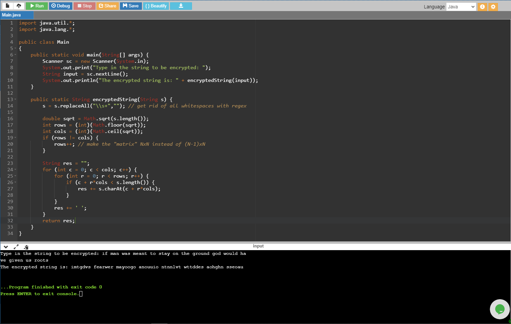
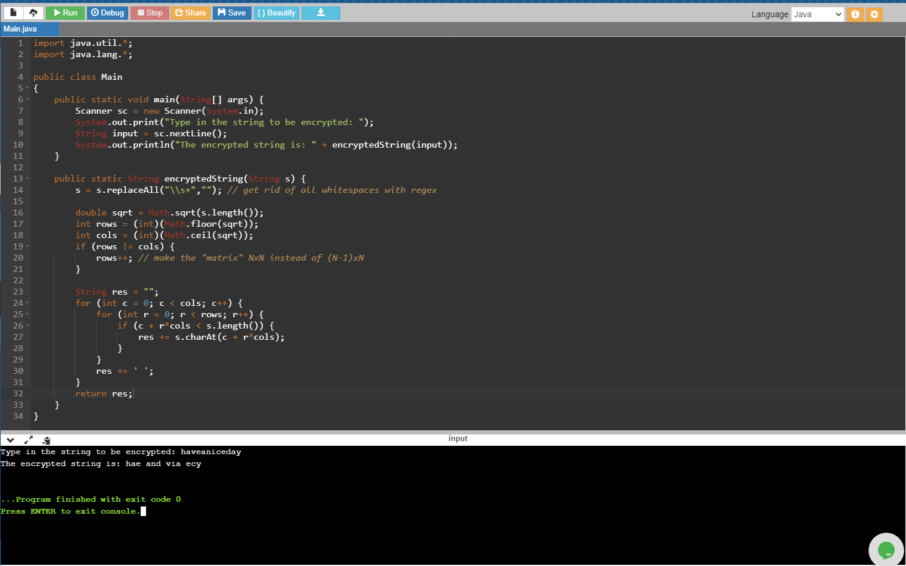

# SnapCheck Coding Challenge Solution

This is my final solution for SnapCheck's Coding Challenge. The overall time complexity 
of my solution is still O(N2), but the space complexity has been improved
significantly, down to O(1). This was achieved by accessing the final encrypted string's
indices in place, rather than using a matrix buffer.

Two of the mentioned inputs in the ChallengeDescription.md file were tested, and their outputs
have been posted below.

